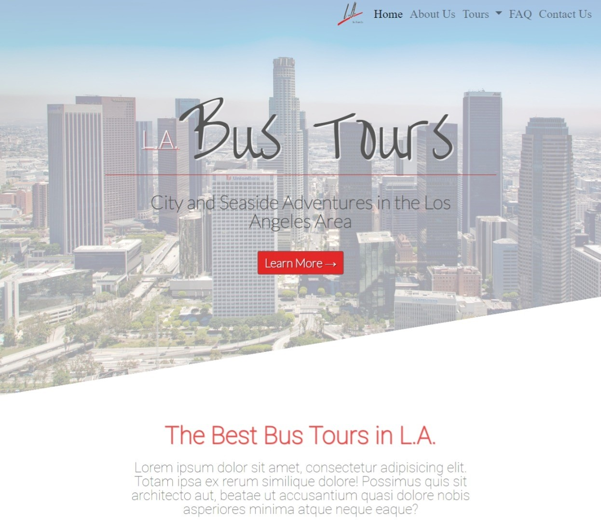
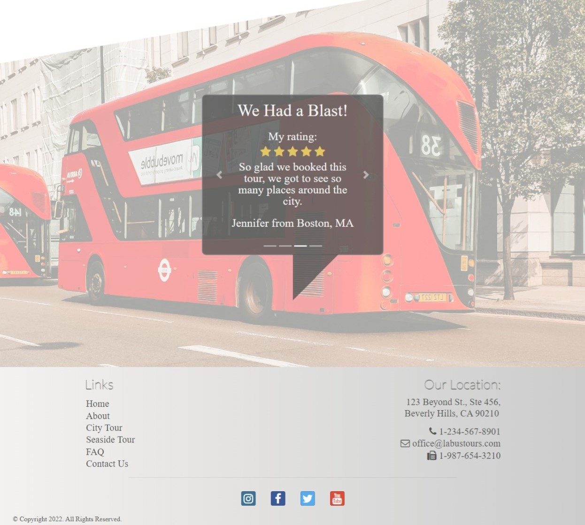
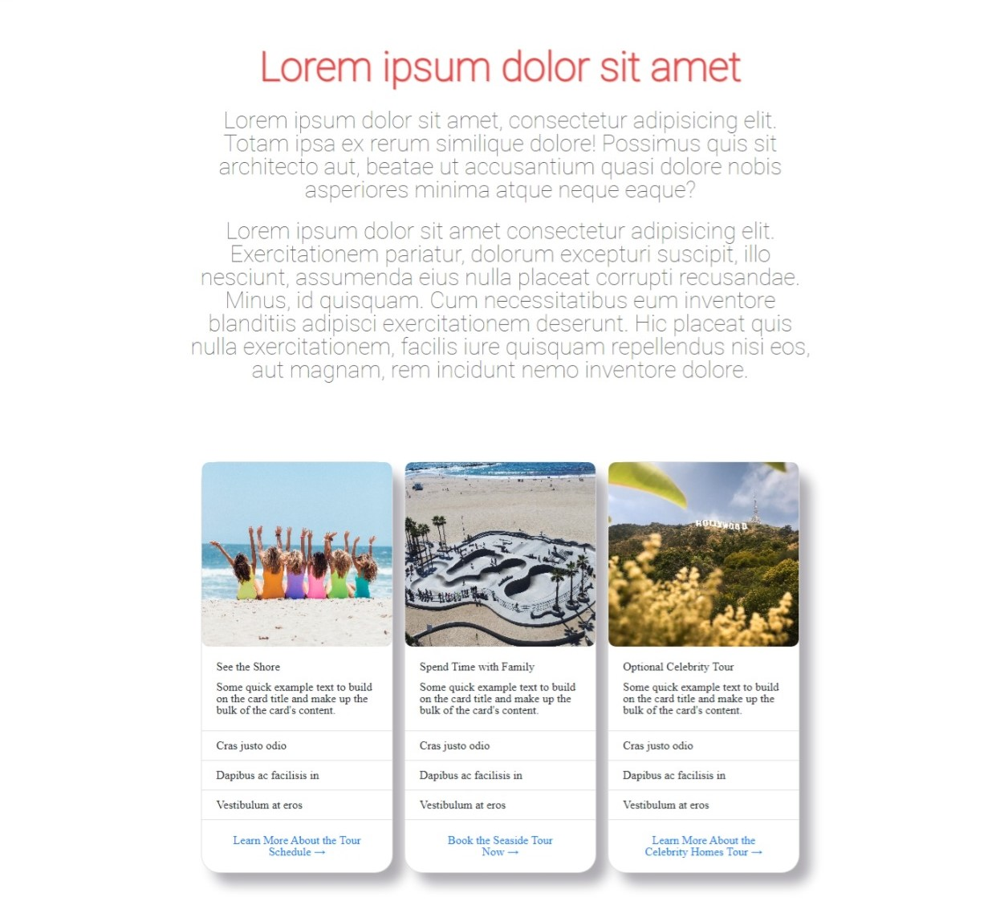
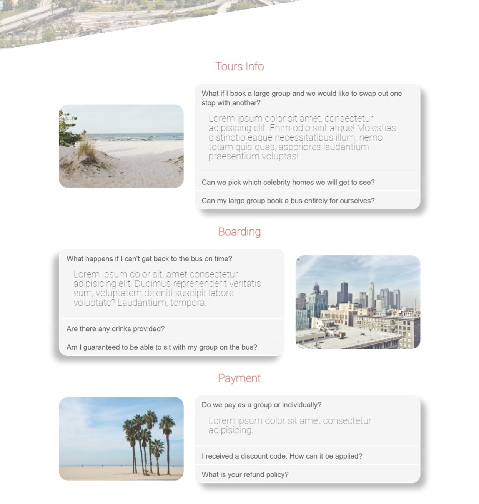
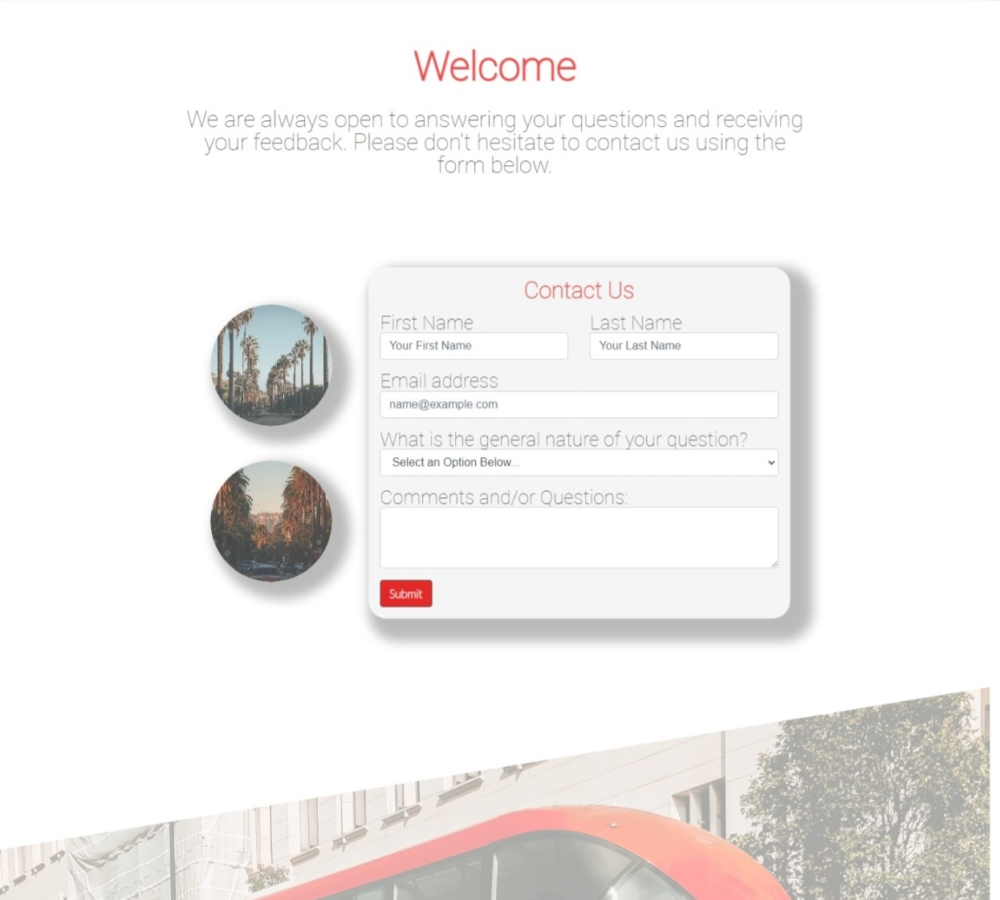

## L.A. Bus Tours Co.

A React application for a bus tour company. Built with React, Reactstrap, React-Router-Dom, Bootstrap, CSS, and jQuery.

## Project Screen Shots 

Home Page Jumbotron

The home page displays a jumbotron with introductory information.

Home Page Review Carousel

There's a review carousel that automatically switches slides. Alternatively, it can manually be changed by clicking on the arrows to the left or right of the review.

Bus Tour Detail Cards

The two tour pages display bootstrapped cards outlining some of the trip details.

F.A.Q Accordions

Bootstrap accordions are used to display frequently asked questions.

Contact Form

The Contact page displays a form for visitors to send a message.

## Installation and Setup Instructions

Clone this repository. You will need `yarn` installed on your machine.  

Installation:

`yarn install`   

To Start Server:

`yarn start`  

To Visit App (assuming you have no other application running on port 3000):

`localhost:3000/`  

## Reflection 

This project was built primarily while I was studying in the Nucamp Full Stack Web and Mobile Application Development Bootcamp, during the React course. Initially I built this website during the Bootstrap course as an HTML-based website. In the React course, it was advised for us to convert our projects into React so we could focus on learning how to work with components and JSX.

While implementing this project I ran into several challenges. One of the challenges was learning how data flows through components (aka through props) and how to use hooks. Another challenge was finding that some of the bootstrap code broke on conversion, so I added in Reactstrap to get the model component to work. Additionally, the lack of being able to use internal page links took some time to resolve, and ultimately ended in the installation of react-scrollchor to fix the problem. Overall, this project was a great learning experience.

## References:

-Advanced CSS and Sass: Flexbox, Grid, Animations and More! by Jonas Schmedtmann - https://www.udemy.com/course/advanced-css-and-sass/ (Natours project - For the clip-path in the jumbotron and inspiration for the UI design.)
-w3schools.com 

# Note

This project was bootstrapped with [Create React App](https://github.com/facebook/create-react-app).
